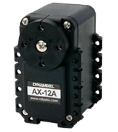

<div align="center">
  
</div>
<br>
<h1 align="center">STM32 Library for Dynamixel</h1>
<div align="center">


<br>


</div>

> [!NOTE]
>
> This project was configured using [STM32CubeIDE](https://www.st.com/en/development-tools/stm32cubeide.html) with the [STM32F411CEU6](https://www.st.com/en/microcontrollers-microprocessors/stm32f411ce.html) as the target MCU.

## Table of Contents
- [Table of Contents](#table-of-contents)
- [🙏 Credits](#-credits)
- [📖 About](#-about)
- [📦 Structure](#-structure)
- [🚀 How to Use](#-how-to-use)
- [🔧 Build](#-build)
  - [🎯 Change Target](#-change-target)
- [📜 License](#-license)

## 🙏 Credits

- Gratitude to [FluffLescure](https://github.com/FluffLescure) for contributions including:
  - Enhancing the code
  - Resolving issues in reading functions

## 📖 About

This project is a straightforward STM32 implementation featuring a library designed to control and interact with the [AX-12A](https://emanual.robotis.com/docs/en/dxl/ax/ax-12a/) Dynamixel.

The **dynamixel** module includes implementations for both Protocol **V1.0** and **V2.0**, making it compatible with **all Dynamixel** series. Users should adjust the function calls according to the specific protocol version they are using.

> [!IMPORTANT]
>
> It's crucial to note that all high-level read and write functions are configured to use **Protocol V1.0** by default. This is implemented through the functions `dynamixel_read_v1` and `dynamixel_write_v1`.
>
> Should your project require the use of **Protocol V2.0**, you can utilize the corresponding functions designed specifically for that protocol.


## 📦 Structure

**Directories:**
- [**Src**](./Core/Src/): Source files (`.c`)
- [**Inc**](./Core/Inc/): Header files (`.h`)

**Files:**
- `dynamixel.c`: Module for AX-12 interaction
- `main.c`: Main file showcasing usage examples

## 🚀 How to Use

Refer to the [`main.c`](./Core/Src/main.c) file and the **main** function to learn how to utilize the **dynamixel** specific functions.

For a comprehensive understanding of the functions available, including detailed descriptions of their purposes and the specific arguments they require, you can consult the official [documentation](https://emanual.robotis.com/docs/en/dxl/ax/ax-12a/).

It is highly recommended to review this documentation to ensure proper usage and integration of the functions within your projects.


## 🔧 Build

> [!WARNING]
>
> STM32CubeIDE builds the project exclusively for the specified target (MCU).

To build this project, first install [STM32CubeIDE](https://www.st.com/en/development-tools/stm32cubeide.html) on your system. Then, clone this repository:

```bash
git clone https://github.com/leoraclet/dynamixel-stm32
```

Open or import the project into STM32CubeIDE.

### 🎯 Change Target

If you wish to build for a different target, create a new project for the desired target and copy the source files from this project, along with the corresponding headers, into your new project.

To accomplish this, you can refer to the official [STM32 Wiki](https://wiki.st.com/stm32mpu/wiki/How_to_get_started_with_STM32CubeIDE_from_scratch). This comprehensive guide provides step-by-step instructions and valuable insights to help you get started with STM32CubeIDE from scratch.


## 📜 License

This project is licensed under the MIT License - see the [LICENSE](LICENSE) file for details.